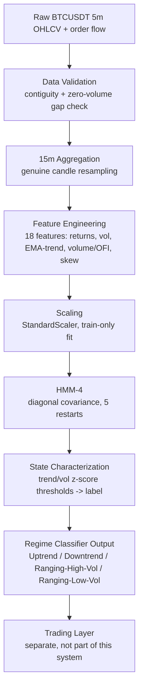
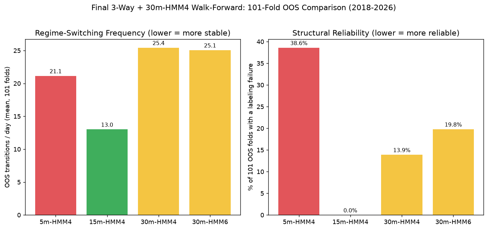
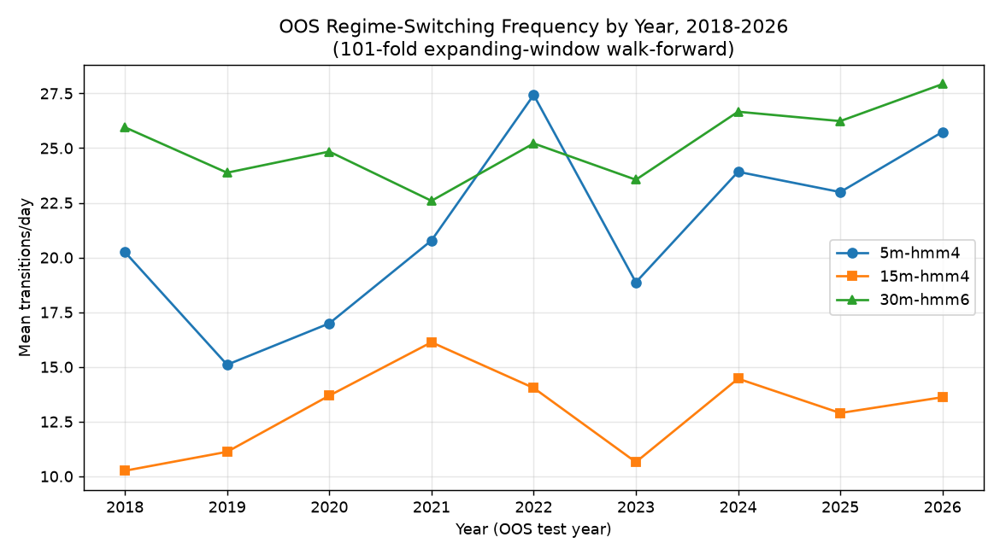
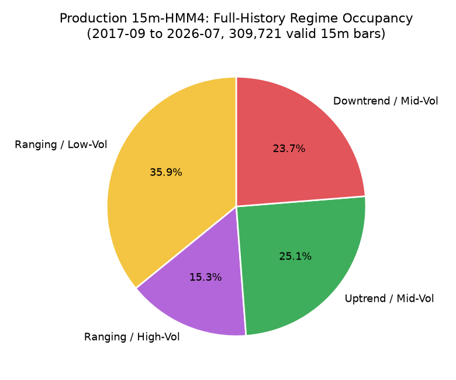
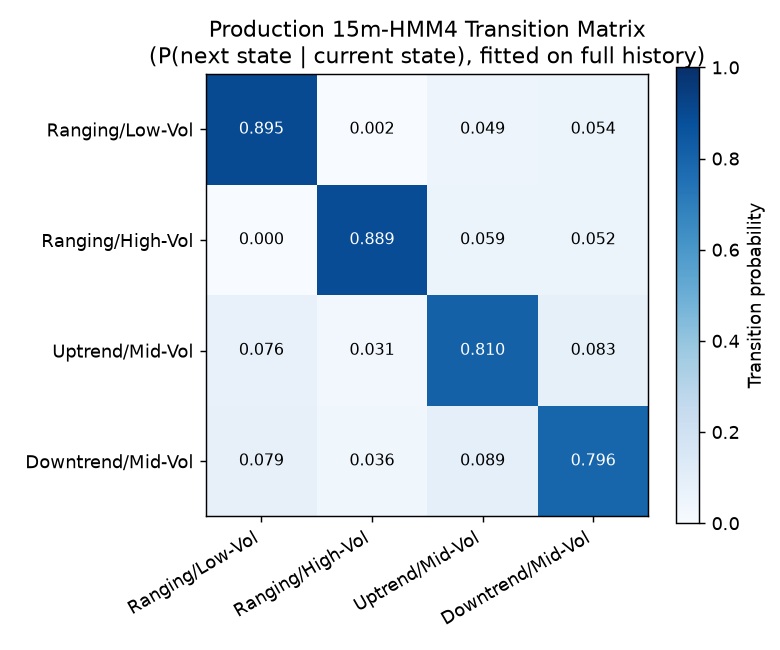
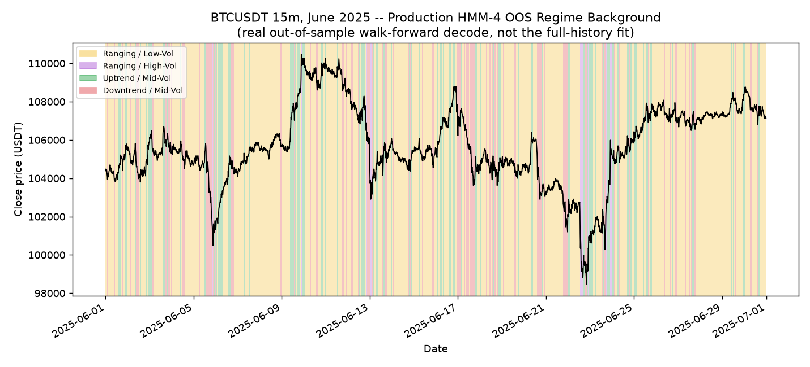
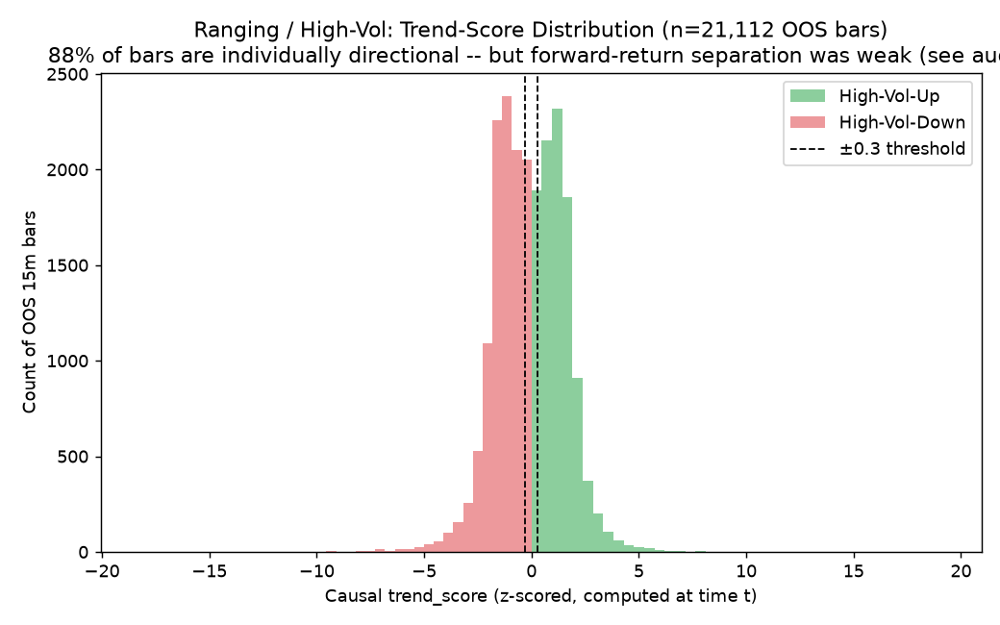
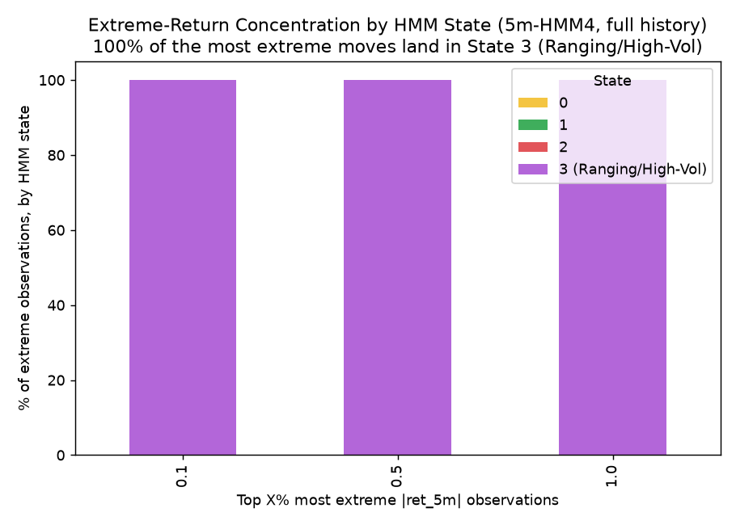

# BTCUSDT Regime Classification System

A Hidden Markov Model that classifies BTCUSDT price action into one of four market regimes, updated every 15 minutes, validated on 8+ years of out-of-sample data via expanding-window walk-forward testing.

## 1. Project Overview

This project builds a **regime classifier** for BTCUSDT: given recent price/volume/order-flow behavior, it identifies which of four statistically distinct market environments the asset is currently in. It does **not** predict future price — it describes the *current* environment, so that a separate trading/entry layer can decide what kind of setups make sense right now.

- **Instrument**: BTCUSDT
- **Base timeframe**: 15 minutes (production)
- **History**: 2017-09-01 → 2026-07-18 (~9 years, 5-minute source data)
- **Why regime detection**: BTC alternates between trending and range-bound periods with very different volatility characteristics. A strategy that ignores this treats a calm grind and a violent breakout identically. Classifying the regime first lets downstream logic adapt.
- **Current production objective**: ship the most *stable and reliable* regime classifier validated so far — not the most complex one. The entire research history (below) is a series of comparisons that progressively rejected more complex alternatives (RF, persistence gate, HMM-6, 30-minute base, directional High-Vol splitting) in favor of a simpler model that survived genuine out-of-sample testing.

## 2. System Architecture



Production code for this pipeline lives in [`production/hmm_15m/`](production/hmm_15m/).

## 3. Data

- **Source**: Binance BTCUSDT klines, 5-minute bars, `2017-09-01` → `2026-07-18` (933,924 bars).
- **Fields used**: OHLCV plus order-flow-derived `avg_price`, `buy_vol`, `sell_vol` (aggressive-buy/sell volume; `ofi = buy_vol - sell_vol`).
- **Contiguity**: verified programmatically — the raw 5m series has zero missing timestamps across its entire span (checked, not assumed).
- **Zero-volume/gap investigation**: 2,183 five-minute bars have zero trading volume across the full history (genuine low-liquidity periods, not missing data — Binance returns a flat OHLC row even with no trades). A bar is excluded from model fitting if its own feature lookback window touches a zero-volume bar — this protects rolling features from being computed across a period with no real price discovery, without ever deleting a raw row. See [`research/model_selection/`](research/model_selection/) and [`research/outlier_analysis/`](research/outlier_analysis/) for the full verification.
- **15m aggregation**: genuine candles built by resampling the 5m source (open=first, high=max, low=min, close=last, volume=sum) on clock-aligned 15-minute boundaries. A bucket is only kept if it contains all 3 underlying 5m bars — partial edge buckets are dropped, never fabricated.

## 4. Feature Engineering

18 production features, all backward-looking only (no feature uses information from bar *t+1* or later). Implementation: [`production/hmm_15m/features_15m.py`](production/hmm_15m/features_15m.py).

| Family | Features | Definition |
|---|---|---|
| Returns (5) | `ret_15m, ret_30m, ret_1h, ret_2h, ret_4h` | `log(close).diff(N)` at economically-scaled bar counts (1/2/4/8/16 bars) |
| Volatility (4) | `vol_30m, vol_1h, vol_2h, vol_4h` | Rolling std of the 1-bar log return, same horizons |
| Trend (3) | `ema_dist_fast, ema_dist_slow, ema_slope_fast` | Causal EMA log-distance/slope (fast=8 bars, slow=24 bars, slope lag=3 bars) — production's own trend family, since raw returns alone don't capture EMA-relative positioning |
| Volume (2) | `vol_change, vol_zscore` | Bar-over-bar volume change; volume z-scored against its own rolling 1h mean/std |
| Order flow (2) | `ofi_raw, ofi_zscore` | Order-flow imbalance (`buy_vol - sell_vol`), raw and rolling-1h-z-scored |
| Distributional (2) | `skew_2h, updown_asymmetry` | Rolling skew of 1-bar returns over 2h (the shortest window wide enough for skew to be mathematically defined — see §7 below); fraction of a 2h window's movement that was upward |

**Lookback windows are economic-time-scaled, not bar-count-copied**: a "1h" feature is 4 bars at 15m (not the 12-bar count that meant 1h at the old 5m base). All rolling windows are causal (`.rolling()`/`.diff()`/`.ewm()` — pandas' own backward-only operators); no centering, no future data anywhere in the feature set.

## 5. Scaling

`StandardScaler`, fit **once on training data only**, then applied via `.transform()` to any test/live data — the scaler's mean/std are frozen at fit time and never refit on new data without an explicit retrain. Fitting a scaler on the full dataset (train+test combined) would leak the test period's own statistical properties into the "normal" reference the model is scored against — every walk-forward fold in this project's validation history fits its own scaler on that fold's training window only.

## 6. Why HMM?

A **Hidden Markov Model** assumes the market is, at any moment, in one of a small number of unobserved ("hidden") states, each with its own characteristic distribution of the observed features (here: Gaussian, diagonal covariance). The model learns both the emission distributions and the transition probabilities between states from data.

This project investigated HMMs specifically because regimes are inherently *temporal* — a "trending" period isn't defined by one bar's return, it's defined by a run of bars behaving similarly, with some persistence. An HMM's transition matrix directly represents "how likely is the current regime to continue," which a stateless classifier (e.g. a single-bar GMM) does not model.

**HMM vs. GMM**: a Gaussian Mixture Model clusters observations into components with no notion of order or persistence — it would classify each bar independently based on that bar's own features. The HMM's Viterbi decoding instead finds the most likely *sequence* of states given the whole path, using the transition matrix to discourage implausible rapid flipping. This project does not claim the HMM is the only possible approach — GMM-style clustering was one of the reference points considered during model selection, not a separately built and tested alternative in this repository.

## 7. Model Selection

- **HMM-4 vs HMM-6**: `research/model_selection/` (rolling-vs-expanding experiment) originally chose HMM-4 over HMM-6 for the 5m baseline — HMM-6 had marginally better log-likelihood but its 6 states collapsed onto fewer human-readable labels, and it cost ~2.4x more to retrain. HMM-4's simpler 4-label structure carried forward into every later experiment, including the final 15m/30m timeframe comparison.
- **Restart strategy**: 5 random restarts (seeds 42-46), diagonal covariance, `n_iter=100`, best restart selected by **training** log-likelihood only — never by held-out performance, to avoid any test-set leakage into model selection.
- **Convergence/stability**: the rolling-vs-expanding experiment found zero degenerate (one state >95% occupancy) folds and zero convergence failures for HMM-4 across 100 folds under the expanding-window strategy.
- **A real, later-discovered wrinkle**: the walk-forward audit of the *final* 15m/30m comparison found that this restart-selection process can still land on a **structurally different but equally-likely** solution in some historical periods — see §9 and `research/directional_analysis/` below.

## 8. Timeframe Research

Two-stage investigation, both included here honestly (screening first, then full validation):

**Stage 1 — fast full-history screening** (`research/timeframe_comparison/`): a cheap, non-walk-forward development fit across 5m/15m/30m × HMM4/HMM6 to filter candidates before expensive validation.



*(Left: mean transitions/day across the 101-fold OOS walk-forward — lower means fewer, more meaningful regime changes. Right: % of folds where the training characterization failed to find a directional state at all.)*

**Stage 2 — 101-fold expanding-window OOS walk-forward** (`research/walk_forward/`), the actual production decision:



**15m-HMM4 had the lowest transitions/day of every configuration tested, in every single year from 2018 to 2026, with no exception.** The 5m baseline additionally failed to find any directional (Uptrend/Downtrend) state in 39 of 101 folds — concentrated in 2019-2021 — a reliability problem invisible to the full-history screening (which pools all 9 years and always finds *some* trend somewhere).

## 9. Walk-Forward Validation

Methodology, reproduced identically across all timeframes/state-counts tested:

- **Expanding window**: training data always starts 2017-09-01 and grows every fold; never a fixed-size rolling window (see §7's rolling-vs-expanding finding — expanding won decisively and that conclusion was reused, not re-derived, here).
- **Monthly OOS folds**: 1-month test window, 1-month step.
- **4-hour embargo**: applied as a real time delta (`test_start - 4h`), not a bar count — equivalent to 48/16/8 bars at 5m/15m/30m, correctly identical in wall-clock terms across timeframes.
- **Train-only scaler, train-only HMM fit, train-only restart selection, train-only state characterization** — test data is decoded only after the model is fully fixed. Verified directly against the executed code, not assumed (see the forensic audit in `research/directional_analysis/directional_inversion_audit.md`).
- **Gap-aware handling**: a timeframe-native validity mask (own bar spacing, not a hardcoded 5-minute assumption) excludes any bar whose feature lookback touches a zero-volume window; `hmmlearn`'s `lengths=` mechanism prevents any transition from being modeled across an excluded gap.

**101 folds**, OOS period 2018-03-01 → 2026-07-18, **879,408 / 292,950 / 146,180 OOS observations** for 5m/15m/30m respectively, **zero failed folds** for any of the four configurations tested (all 505 restarts per model converged).

## 10. Final 3-Way Comparison

| Metric | 5m-HMM4 | 15m-HMM4 | 30m-HMM6 |
|---|---|---|---|
| OOS observations | 879,408 | 292,950 | 146,180 |
| Transitions/day (mean) | 21.14 | **13.01** | 25.06 |
| Median duration | 37.6 min | **64.6 min** | 31.5 min |
| Mean duration | 77.6 min | **123.1 min** | 58.6 min |
| % segments > 1h | 31.9% | **48.0%** | 18.9% |
| % segments > 2h | 15.3% | **25.8%** | 5.0% |
| % segments > 4h | 5.8% | **10.0%** | 1.5% |
| OOS log-likelihood/obs | -14.89 | -12.57 | -8.27 |
| Restart stability (normalized spread) | 0.0036 | **0.0006** | 0.252 ⚠ |
| State separation (trend-score range) | 0.53 | 0.75 | **1.76** |
| Folds with a labeling failure | 39/101 (39%) | **0/101** | 20/101 (20%) |

**15m-HMM4 was selected for production** on the strength of its stability (lowest switching frequency every year) and reliability (zero failure folds) — not because it had the best raw likelihood or the cleanest state separation (30m-HMM6 wins both of those, but at the cost of chronic restart instability and a fifth of its folds losing a state entirely). Full detail, including a 30m-HMM4 run added later for completeness: [`research/walk_forward/final_3way_walkforward_report.md`](research/walk_forward/final_3way_walkforward_report.md).

## 11. HMM Regime Definitions

From the actual fitted production artifact ([`production/hmm_15m/model/production_model_15m_hmm4.pkl`](production/hmm_15m/model/)) — state IDs and labels below are read directly from the saved model, not assumed:

| State | Label |
|---|---|
| 0 | Ranging / Low-Vol |
| 1 | Ranging / High-Vol |
| 2 | Uptrend / Mid-Vol |
| 3 | Downtrend / Mid-Vol |

Labels are derived from each state's fitted mean feature vector: `trend_score` = mean of the 5 scaled return features; `vol_score` = mean of the 3 shortest scaled volatility features. `trend_score > +0.3` → Uptrend, `< -0.3` → Downtrend, else Ranging; `vol_score > +0.3` → High-Vol, `< -0.3` → Low-Vol, else Mid-Vol (the ±0.3 thresholds are this project's standing convention, unchanged since the original 5m model).




*(Full-history occupancy and the fitted transition matrix — diagonal values are each state's own stay-probability per 15-minute step.)*



## 12. High-Vol Directional Split Investigation

**Hypothesis**: could "Ranging / High-Vol" actually be hiding two directional populations — High-Vol-Up and High-Vol-Down — that the 4-state model's characterization collapses into one label because volatility dominates its own average?

Full forensic test on the already-completed OOS walk-forward output (no retraining): a causal, per-bar trend score was computed using the same 5 return features and the same fold-specific train-only scaler the model already used, then split two ways (raw sign, and the existing ±0.3 threshold).



**What the evidence showed**:
- 88% of High-Vol bars are individually directional by the existing threshold (41.8% Up, 46.6% Down, only 11.6% near-zero) — the "Ranging" label is a property of the state's *pooled average*, not of most individual bars.
- High-Vol-Up/Down occur in clearly different transition contexts (Up surrounded by Uptrend regime 61-80% of the time; Down surrounded by Downtrend 72% of the time).
- **But** the forward-return difference between the two groups was economically tiny (Cohen's d ≈ -0.07), only marginally distinguishable from zero (bootstrap CI) at the longest horizon tested (4h), and **reversed sign in 2 of 9 years** — not persistent.
- A control check on the already-known-directional Uptrend/Downtrend states confirmed the measurement methodology itself works and produces a clearer, more robust signal than what High-Vol's own split showed — ruling out "broken methodology" as the explanation for the weak result.

**Decision: keep "Ranging / High-Vol" as one regime.** This was a valid hypothesis test with a clear, evidence-based negative result, not a failure — full report: [`research/directional_analysis/high_vol_direction_split_audit.md`](research/directional_analysis/high_vol_direction_split_audit.md).

## 13. Outlier / Fat-Tail Investigation

The HMM assumes Gaussian emissions. BTC returns are famously fat-tailed, so this was investigated directly rather than assumed away.



- **100% of the top 0.1% / 0.5% / 1.0% most extreme 5-minute returns land in State 3** (Ranging/High-Vol, old 5m model) — confirmed independently twice, via a fat-tail-specific investigation and a separate full outlier-timestamp audit.
- Within-state excess kurtosis is far above the Gaussian reference (0) in State 3 specifically, and fitted-vs-robust (MAD-based) variance shows real inflation there — the Gaussian assumption is most strained in exactly this state.
- **But** State 3 is not purely an outlier bucket: only 24.4% of its own bars are themselves >4σ outliers, and only 34.75% of its segments begin near a major outlier event — most of State 3's footprint is ordinary elevated volatility, not crash bars.
- Outlier bars showed only a modest 1.2x higher immediate-transition rate than normal bars (11.4% vs 9.5%) — **this does not strongly support "fat tails are a primary driver of excessive switching"** elsewhere in the model.

**Conclusion**: the Gaussian emission assumption is measurably imperfect in the high-vol state, but this is a known, bounded, and non-fatal limitation — it did not change the model-selection outcome and was not treated as a blocking issue. Full detail: [`research/outlier_analysis/`](research/outlier_analysis/).

## 14. Other ML Experiments

| Model | Problem | Features | Result | Decision |
|---|---|---|---|---|
| Logistic Regression | Persistence gate: P(trend continues ~2h) | HMM-derived: confidence, stay-prob, log-duration, margin | Holdout AUC 0.520-0.526 across 5m/15m | Retained as the simpler baseline; persistence itself later terminated |
| Random Forest | Same, as an LR alternative | Same 4, plus 15 market-structure features in a later variant | Base RF AUC 0.514; struct-RF AUC 0.523 but train/OOS gap +0.178 and lost to LR in 2025-2026 | **Rejected** — recency reversal, no genuine edge over LR |
| RF (regularized, 7 configs) | Reduce RF's overfit gap | Same as struct-RF | Best (RF-5): AUC 0.525, gap reduced to +0.123 — still lost the same recency check | **Rejected** |
| Gradient Boosted Trees | Persistence gate (final choice over LR) | Same 4 HMM-derived features | Holdout AUC 0.525 (5m) / 0.532 (15m) — beat LR because duration has a genuine U-shaped relationship with persistence that a linear model can't represent | Used only within the persistence gate, which is itself terminated |
| GMM | Reference point during model selection (not separately implemented) | — | — | Not built as a separate tested system — see §6 |

No XGBoost experiment exists in this repository's history — not fabricated here.

## 15. Random Forest / Logistic Regression / Gradient Boosted Trees

**Logistic Regression** — Objective: predict whether an HMM-identified trend persists ~2 hours forward. Architecture: 4 features (confidence, stay-probability, log1p-duration, posterior margin) → `sklearn.LogisticRegression`. Training: chronological split with a 4-hour embargo, scaler fit on train only. OOS performance: AUC 0.520 (5m) / 0.526 (15m). Strength: simple, interpretable coefficients, no overfitting risk. Weakness: cannot represent duration's U-shaped relationship with persistence. Final decision: superseded by GBT within the (now-terminated) persistence line.

**Random Forest** — Objective: same problem, testing whether nonlinear splits capture more signal. Architecture: up to 19 features (4 HMM-derived + 15 market-structure), depth/leaf-regularized in a 7-config sweep. Training/validation: identical walk-forward cache reused from the LR experiment, no re-fit of the HMM. OOS performance: best regularized AUC 0.525, but a persistent train-OOS gap and a 2025-2026 recency loss to plain LR. Strength: captures some nonlinearity in the market-structure features. Weakness: overfits relative to its OOS gain; the extra complexity bought no durable edge. Final decision: **rejected**.

**XGBoost** — not tested in this project. Documented here explicitly rather than silently omitted, per this project's own "do not fabricate results" rule.

## 16. Research Timeline

```mermaid
flowchart LR
    A[Data validation<br/>gap/zero-volume check] --> B[Feature engineering<br/>v7-v15]
    B --> C[HMM experiments<br/>rolling vs expanding]
    C --> D[HMM-4 vs HMM-6<br/>comparison]
    D --> E[Persistence gate<br/>LR -> RF -> GBT]
    E --> F[Timeframe screening<br/>5m/15m/30m x HMM4/HMM6]
    F --> G[101-fold walk-forward<br/>final 3-way validation]
    G --> H[Outlier / fat-tail<br/>investigation]
    H --> I[High-Vol directional<br/>split audit]
    I --> J[15m-HMM4<br/>production system]
```



## 17. What We Tried and What We Learned

| Experiment | Hypothesis | Result | Decision | Reason |
|---|---|---|---|---|
| Rolling vs expanding window | Which training-window strategy generalizes better? | Expanding wins 91-96/100 folds, p ≈ 3×10⁻²⁷ | **Adopted expanding** | Decisive, grows over time, no stability cost |
| HMM-4 vs HMM-6 (5m) | More states = better fit? | HMM-6 marginally better LL, but labels collapse | Chose HMM-4 (at the time) | Simplicity + cost, later re-tested at 15m/30m |
| Random Forest vs LR | Can nonlinear splits improve the persistence gate? | RF's edge didn't survive a recency check | **RF rejected** | Overfitting, not genuine signal |
| RF regularization (7 configs) | Can regularization fix RF's gap? | Gap shrank, recency loss did not | **Still rejected** | Same failure mode persisted |
| Fast timeframe screening | Does 15m/30m reduce excessive switching? | Yes, both reduce switching vs 5m in-sample | Proceed to full OOS validation | Screening result needed OOS confirmation |
| 101-fold walk-forward (5m/15m/30m) | Does the screening result survive OOS? | 15m confirmed best; 5m's own reliability gap discovered; 30m-HMM6 unstable | **15m-HMM4 selected for production** | Most rigorous evidence in the project |
| High-Vol directional split | Is "Ranging/High-Vol" secretly two regimes? | Descriptively yes, predictively no (tiny, unstable effect) | **Keep as one regime** | Forward-return evidence didn't clear the bar |
| Fat-tail/outlier investigation | Is the Gaussian HMM broken by BTC's fat tails? | Real but bounded — State 3 isn't purely an outlier bucket | **No architecture change** | Limitation acknowledged, not blocking |
| Persistence gate (LR → GBT) | Can HMM state alone predict forward persistence? | Weak but real signal, AUC ~0.52-0.53 | **Terminated for the current system** | Out of scope for this production release |

## 18. Current Production System

**CURRENT PRODUCTION MODEL: 15-minute HMM-4 Regime Classifier.** Only.

- Persistence is **NOT** part of the current system.
- The 5m HMM is **NOT** part of the current production system (archived: `research/abandoned_models/`).
- The 30m HMM is **NOT** part of the current production system (archived: `research/timeframe_comparison/`, `research/walk_forward/`).
- High-Vol directional splitting is **NOT** part of the current production system (rejected: `research/directional_analysis/`).

## 19. Current Regime → Trading Interpretation

| Regime | Interpretation |
|---|---|
| Uptrend / Mid-Vol | Long-side setups |
| Downtrend / Mid-Vol | Short-side setups |
| Ranging / High-Vol | Potentially long or short, depending on separate entry/direction logic |
| Ranging / Low-Vol | No trade by default |

**The HMM is a regime classifier, not a complete trading strategy.** It identifies the market environment; a separate entry/execution layer (not part of this repository) decides whether and how a trade is actually placed. Nothing in this project's validation claims that regime classification alone is profitable.

## 20. Reproducibility

```bash
# Install dependencies
pip install -r requirements.txt

# Train the production model from scratch (fits on all available history)
cd production/hmm_15m
python train_production_model.py

# Get the current live regime (fetches recent data from Binance)
python predict.py
```

To regenerate research artifacts, each script in `research/` is runnable standalone from its own folder — see the docstring at the top of each for its exact inputs/outputs. Large intermediate caches are not committed (see `.gitignore`); they regenerate from the raw data + scripts.

## 21. Project Status

- **PRODUCTION**: 15m HMM-4 Regime Classifier (`production/hmm_15m/`)
- **RESEARCH / ARCHIVED**: all experiments (`research/`) — preserved in full, including rejected approaches
- **TERMINATED**: Persistence gate (`research/persistence/`) — not active, not imported by production, not a hidden dependency

---

Full technical detail beyond this README: [`docs/PROJECT_DOCUMENTATION.md`](docs/PROJECT_DOCUMENTATION.md). Research directory index: [`research/README.md`](research/README.md).
