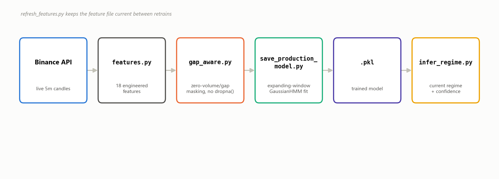
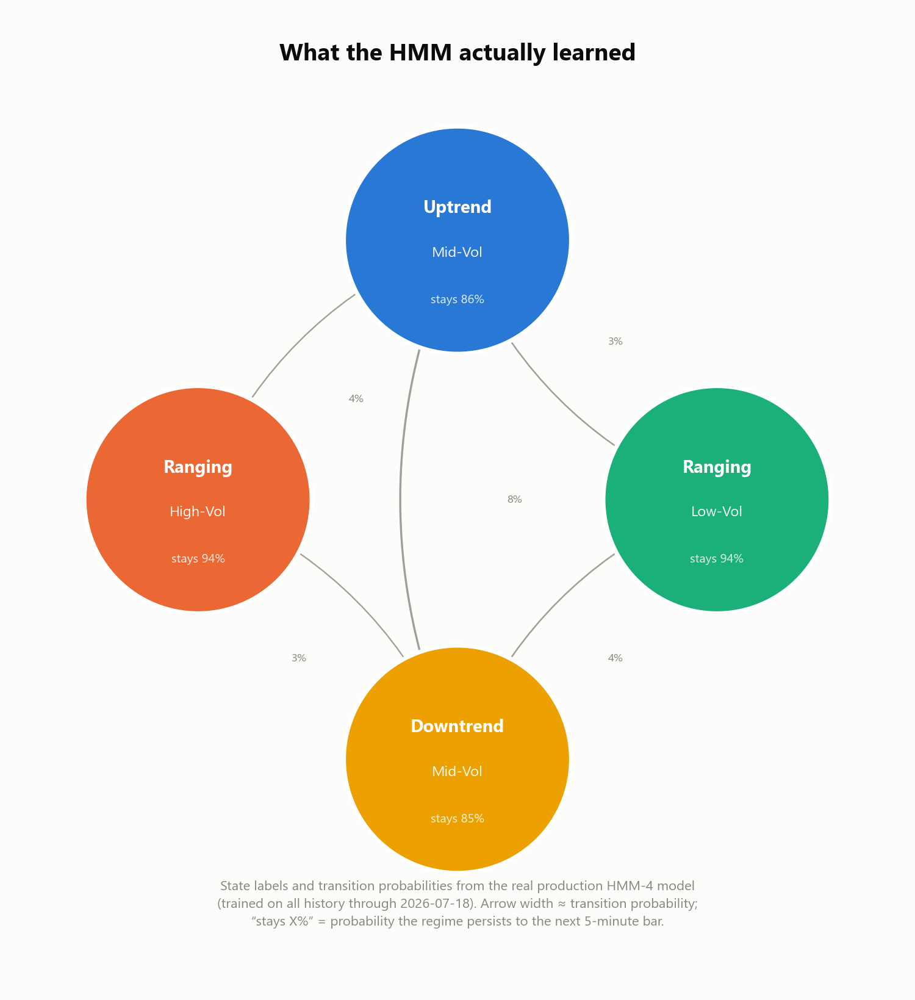

# Regime Detector

A Gaussian HMM regime detector for BTCUSDT (5-minute bars): classifies the market into a small number of hidden "regimes" (e.g. uptrend, downtrend, ranging / low-vol, ranging / high-vol) from returns, volatility, volume/order-flow, and skew features.

## Key finding

A 100-fold walk-forward experiment compared two training-window strategies — a fixed rolling 6-month window vs. an expanding window that trains on all available history — across both a 4-state and 6-state HMM. **Expanding-window wins decisively out-of-sample** (HMM-4: 91/100 folds, HMM-6: 96/100 folds, both far beyond chance), so that's what this repo's production model uses.

**[See `RESULTS.md` for charts and the full breakdown](RESULTS.md)**, or [`Data/rolling_vs_expanding_final_report.md`](Data/rolling_vs_expanding_final_report.md) for the complete methodology and all nine conclusion questions answered against the data.

## Pipeline



`refresh_features.py` incrementally updates the local feature file with new bars from Binance without rebuilding history from scratch.

## What is a "regime," actually?

Not a label anyone assigned by hand — it's whatever the HMM's own math discovers by fitting a Gaussian mixture with Markov transitions to the feature history, then each state gets characterized after the fact from its own mean feature vector (trend direction from the return columns, volatility level from the vol columns). Below is exactly what the real production HMM-4 model (`Data/production_model_hmm4.pkl`) learned — 4 states, their self-transition probability (how often a regime persists to the next 5-minute bar), and how they transition into each other:



Two things worth noticing: every regime is far more likely to persist than to switch (85-94% self-transition), and the two "Ranging" states are the stickiest — matching the intuition that calm/directionless markets tend to stay that way longer than trends do.

## Usage

All commands run from `src/`.

**Get the current regime right now** (fetches live data from Binance):
```
python infer_regime.py [N_STATES] [CONTEXT_BARS]
# e.g. python infer_regime.py 4 500
```

**Retrain the production model** on all available history:
```
python save_production_model.py [N_STATES]
# e.g. python save_production_model.py 4   (defaults to 4 if omitted)
```

**Refresh the local feature file** with new bars since it was last built:
```
python refresh_features.py
```

## Files

| File | Purpose |
|---|---|
| `features.py` | Raw OHLCV+order-flow → 18 engineered features |
| `src/gap_aware.py` | Zero-volume/gap validity mask + segment-aware fitting (no `dropna()`) |
| `src/scaling.py` | `StandardScaler` wrapper (fit on train only) |
| `src/save_production_model.py` | Trains and pickles the production HMM (expanding window) |
| `src/binance_fetch.py` | Live 5m candle fetch from Binance's public API |
| `src/refresh_features.py` | Incrementally appends new bars to the feature file |
| `src/infer_regime.py` | Loads a saved model + live data → current regime |
| `Data/production_model_hmm4.pkl` | **Production model** (4-state, `infer_regime.py`/`save_production_model.py` default) |
| `Data/production_model_hmm6.pkl` | 6-state model kept for reference/comparison — not used in production (see `RESULTS.md`) |
| `Data/rolling_vs_expanding_final_report.md` | Full experiment write-up behind the training-strategy choice |

`Data/features_out.csv` and `Data/features_out_masked.csv` (the full historical feature matrices, ~785MB combined) are gitignored — regenerate locally via `refresh_features.py` starting from an existing copy, or the original feature-building pipeline.

## Known gaps / not yet production-hardened

- No scheduler — `refresh_features.py` / `infer_regime.py` are run manually, not on a cron/service.
- No crash-safe (atomic) write for the feature-file append.
- No automated tests currently in the repo.
- `binance_fetch.py`'s `avg_price`/`buy_vol`/`sell_vol`/`ofi` are proxies derived from Binance's public kline fields (the original raw data's exact methodology for those columns is undocumented/unavailable) — `open`/`high`/`low`/`close`/`volume` are exact.
- Gap detection is zero-volume-based; a genuinely *missing* (not zero-volume) candle from the live feed isn't separately reindexed/caught yet.
