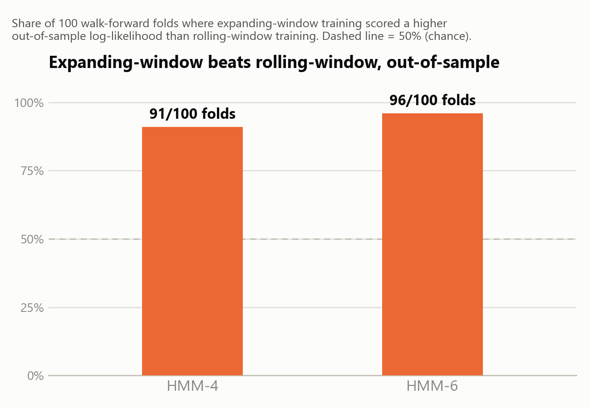
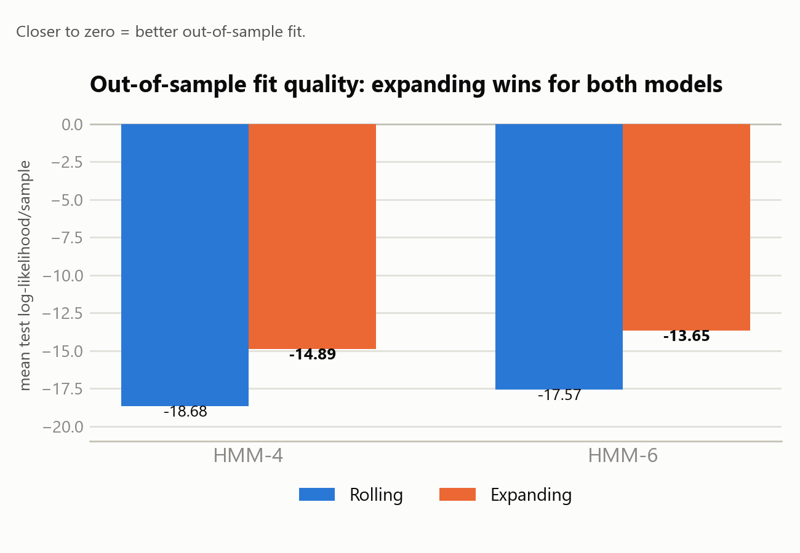
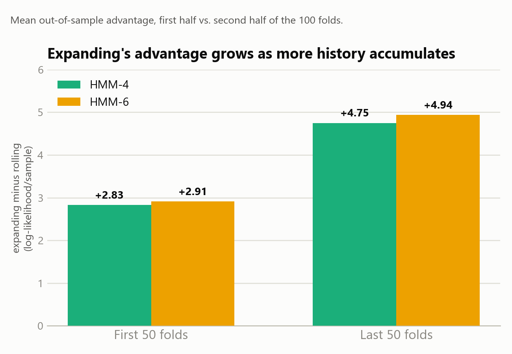
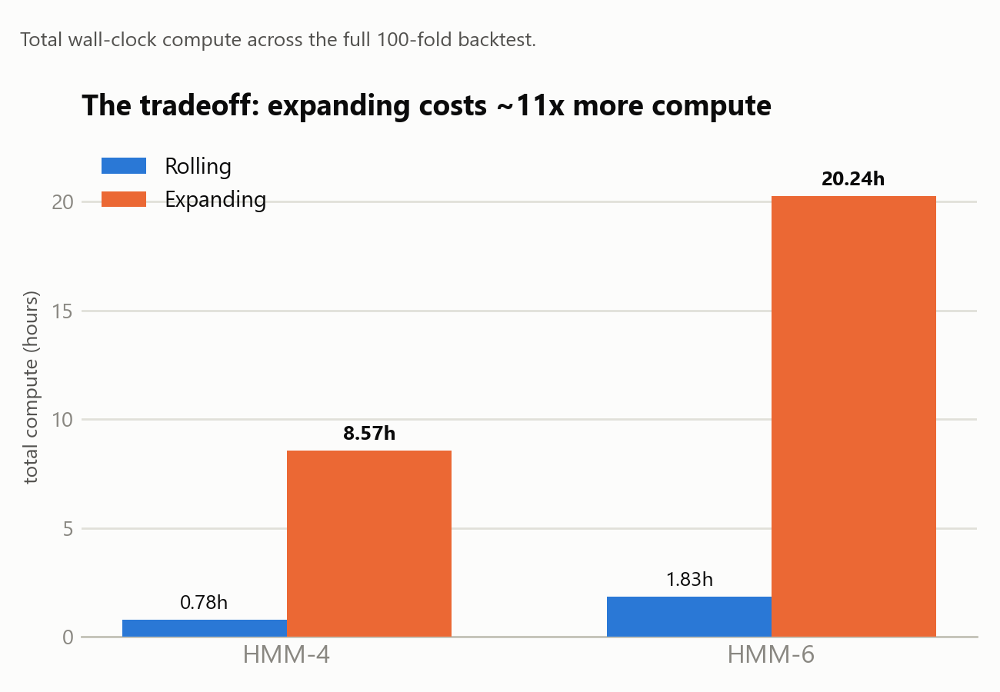

# Rolling vs. Expanding: Experiment Results

**The question:** should the HMM regime detector retrain on a fixed rolling window (the original approach — always the most recent 6 months) or an expanding window (all available history, growing every retrain)?

**The method:** 100 walk-forward folds, identical test periods for both strategies, identical HMM architecture (4-state and 6-state, 5 random restarts each, best kept by training log-likelihood — never by test performance), identical gap-aware data handling (no blanket `dropna()` — zero-volume/gap bars are masked, not deleted, and verified against Binance's own historical API to be genuine, not data errors). The only thing that differs between the two tests is how much training history each fold gets.

## Expanding wins, decisively

Not a coin flip and not noise — HMM-4 wins 91 times out of 100, HMM-6 wins 96 times out of 100. A paired t-test on the log-likelihood differences puts this at p ≈ 3×10⁻²⁷ (HMM-4) and p ≈ 3×10⁻²⁹ (HMM-6).

## The fit is meaningfully better, not just "more often"

Expanding isn't squeaking by — it's a real, consistent gap in how well the model explains held-out data, for both architectures.

## And the advantage grows over time

Early in the walk-forward series, expanding-window has barely more data than rolling-window does (there isn't much history to expand into yet). By the back half, expanding is training on years of extra data rolling-window has already discarded — and the gap nearly doubles. This is exactly the pattern you'd expect if the fixed 6-month window is genuinely throwing away useful long-horizon signal.

## The honest tradeoff: compute cost

Expanding-window trains on progressively more data every fold — by the last fold it's ~900K bars vs. rolling's fixed ~52K. That shows up directly in compute cost: roughly **11x** more for both models. In production terms this is a single retrain, not a 100-fold backtest — a one-off HMM-4 retrain on the full history takes on the order of ~9 minutes, not hours (HMM-6 would run ~20-25 minutes for the same retrain, part of why HMM-4 was chosen for production). Still worth knowing the shape of the tradeoff before choosing a retraining cadence.

## Bottom line

Expanding-window is the better choice — wins decisively out of sample, the win grows over time, and shows no stability degradation (zero degenerate/collapsed-state folds, zero convergence failures, in either test). The production model in this repo (`Data/production_model_hmm4.pkl`) is trained this way. HMM-6 edges out HMM-4 slightly on out-of-sample likelihood, but HMM-4 was chosen for production: it's ~2.4x cheaper to retrain and its 4 states each map to a distinct human-readable label, whereas HMM-6's 6 states collapse onto only 4 distinct labels under the current labeling scheme (three separate states all read as "Ranging / Low-Vol").

For the full methodology, restart-stability breakdown, gap-handling coverage analysis, and all nine conclusion questions answered against the data: **[`Data/rolling_vs_expanding_final_report.md`](Data/rolling_vs_expanding_final_report.md)**.
